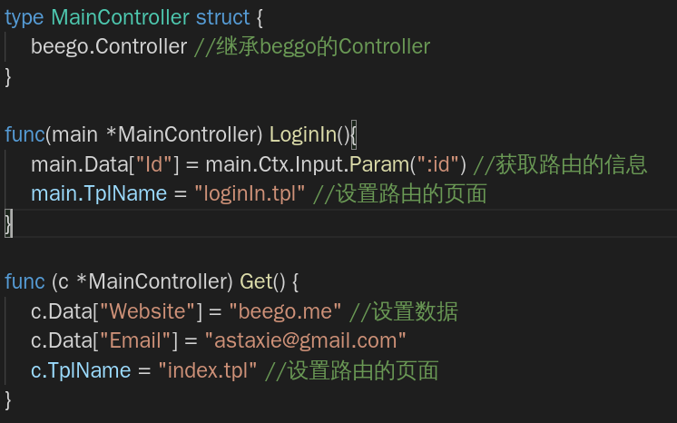
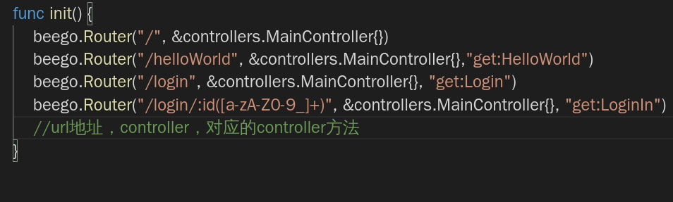
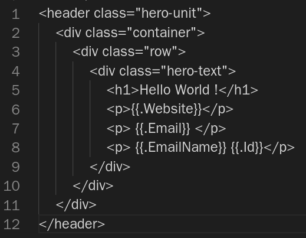
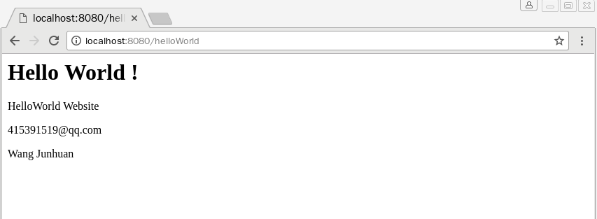
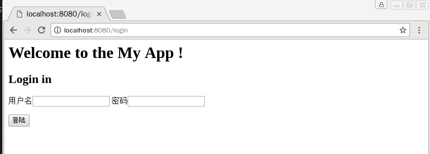
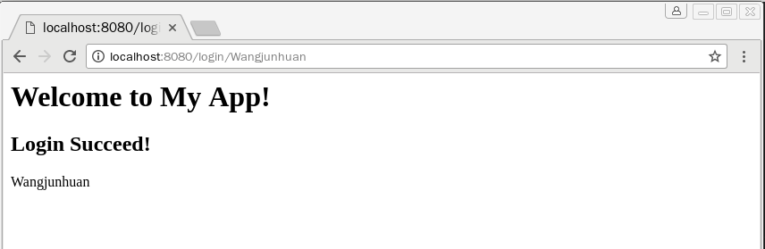
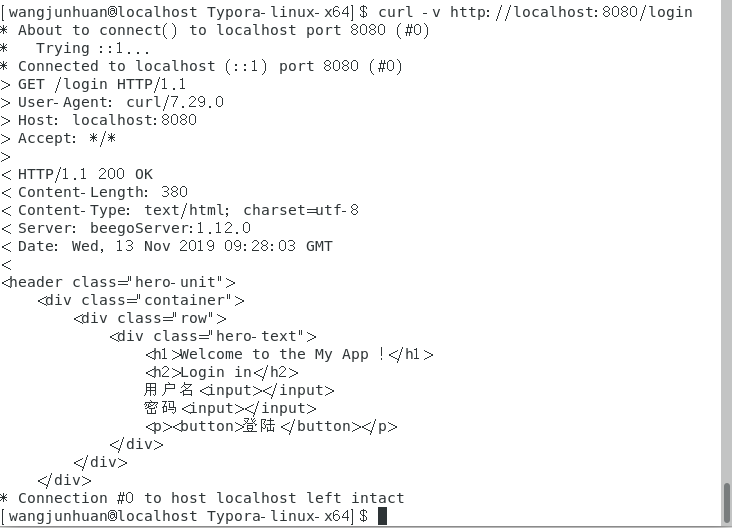

# 开发Web服务程序
17308154 王俊焕
## 一、实验目标
1. 熟悉 go 服务器工作原理
2. 基于现有 web 库，编写一个简单 web 应用类似 cloudgo。
3. 使用 curl 工具访问 web 程序
4. 对 web 执行压力测试
## 二、实验要求
1. 编程 web 服务程序 类似 cloudgo 应用。
 	- 要求有详细的注释
 	- 是否使用框架、选哪个框架自己决定 请在 README.md 说明你决策的依据
2. 使用 curl 测试，将测试结果写入 README.md
3. 使用 ab 测试，将测试结果写入 README.md。并解释重要参数。
## 三、实验过程
### 1. 框架选用：beego
- [CSDN博客：最好的6个Go语言Web框架](https://blog.csdn.net/dev_csdn/article/details/78740990)中提到截至2017年最好的6个语言Web框架。它们分别是
     - [Beego](https://github.com/astaxie/beego)：高性能web框架
     - [Buffalo](https://github.com/gobuffalo/buffalo)：快速Web开发框架
     - [Echo](https://github.com/labstack/echo)：高性能、极简的Web框架
     - [Gin](https://github.com/gin-gonic/gin)：提供Martini风格的API并有更好的性能
     - [Iris](https://github.com/kataras/iris)：目前发展最快的Web框架，提供完整MVC功能，并面向未来。
     - [Revel](https://github.com/revel/revel)：高生产率，全栈Go的Web框架

- 我最后选择了人气最高的beego（当前github：star22.5k）。主要出于作为一个新手，应该选择一个相关文档最多的框架进行入门，从而提高自己对开发的兴趣。而beego使用我较为熟悉的MVC架构，并提供了功能全面的API。对于当前开发规模较小项目，beego框架简单的使用方法十分适合，所以选择了beego。用了之后发现具有热加载的功能，更加深得我心。

- 下面是beego官方文档中所描述的beego的features：
    - RESTful支持
    - MVC架构
    - 模块化
    - 自动API文件
    - 注释路由器
    - 命名空间
    - 强大的开发工具
    - Web和API的完整堆栈
### 2. beego的简单使用
1. 首先需要下载安装beego和bee。bee 工具是一个为了协助快速开发 beego 项目而创建的项目，通过 bee 您可以很容易的进行 beego 项目的创建、热编译、开发、测试、和部署。
```shell
go get github.com/astaxie/beego
go get github.com/beego/bee
```
2. 新建项目：需要先进入到`$GOPATH/src`，之后使用`bee new <项目名>`，之后会在`$GOPATH/src`生成如下文件树。其中app.conf是配置文件，我们在里面修改访问的端口。可以看到beego使用MVC框架。


3. 运行：beego初始化时是生成了下面这样的页面，等下我们可以对其进行修改。在目录下使用`bee run`命令，之后在浏览器访问`http://localhost:8080`即可。


4. 更新：主要修改三个部分。
	- /controllers/default.go：控制页面的调用顺序、数据传输
	
	此处MainConTroller相当于继承beego.Controller，它提供了许多接口方便我们对数据进行控制，即常见的Controller层的功能。该go文件里面的定义的方法会与router.go进行对应。(此处是重写了Get方法)
	
	
	
	- /routers/router.go：控制页面与url的对应

	这里应用到了正则表达式，`:id([a-zA-Z0-9_]+)`表示识别由大小写字母、数字、下划线组成的非空字符串，用于识别用户名。它与controller中的LoginIn方法相对应。
	
	
	
	
	- /views：页面渲染（此处是tpl文件而非html文件，但其实差不多，tpl是前端页面的模板文件，具体见[.tpl文件是什么](https://blog.csdn.net/weixin_42246997/article/details/90449004)）
	
	这里主要提一下模板的使用。`{{.Website}}`是直接使用了当前Controller的属性（在controller中定义）。
	
	

5. 实现结果：此处主要是通过修改url直接访问对应的页面
- /helloworld：使用模板的功能打印开发者的邮箱、姓名
   
-  /login：登陆界面

- /login/[username]：登陆成功界面

### 3. curl测试



### 4. ab执行压力测试

